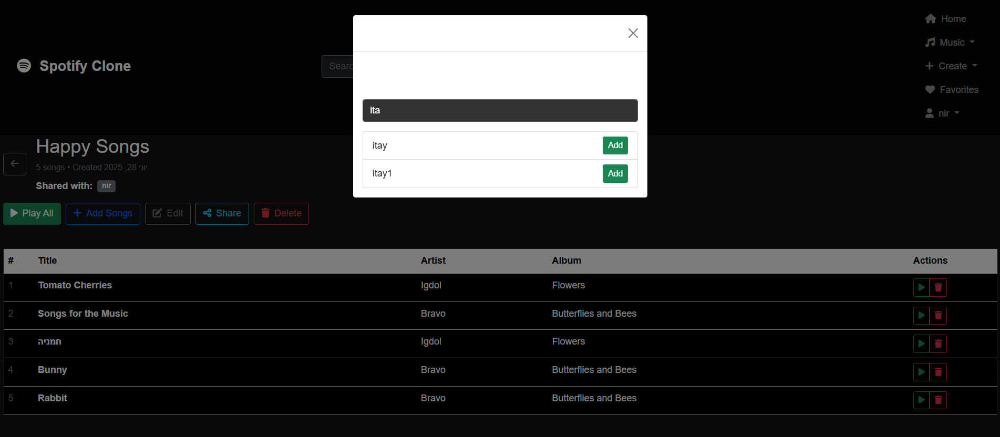

# Spotify Clone 🎵

Spotify Clone is a web-based music streaming application that lets users upload, manage, play, and **share** their own music. Built using Java Spring Boot on the backend and Thymeleaf with Bootstrap on the frontend, it offers features like collaborative playlists, album management, and a fully functional web player.

## Table of Contents
1. [General Functionality](#general-functionality)
2. [Screenshots](#screenshots)
3. [Technologies Used](#technologies-used)
4. [Setup and Installation](#setup-and-installation)
5. [SQL File Information](#sql-file-information)
6. [Credentials](#credentials)
7. [Known Bugs and Limitations](#known-bugs-and-limitations)
8. [Project Structure](#project-structure)

---

## General Functionality

This project replicates key features of a modern music streaming service.

### 🎬 Demo Video

[▶️ Watch the demo video](https://drive.google.com/file/d/13UwqzLOIpav4RpqyUor9IAa-VL1oQcVU/view?usp=sharing)

### User Management
- **Authentication & Registration**: Secure user login, logout, and sign-up using Spring Security.

### Music and Content
- **Upload MP3s**: Users can upload their own MP3 files and add metadata like title, artist, and genre.
- **Album Management**: Create albums with cover art and associate uploaded songs.
- **Explore Songs**: Browse and search all music available in the system.

### Playlists and Sharing
- **Playlist Management**: Create and customize playlists.
- **Collaborative Sharing**: Share playlists with other users for collaborative editing.
- **Favorites**: Mark songs as favorites for quick access.

### Music Player
- **Web Streaming**: Stream uploaded music through a responsive web player.
- **Controls**: Includes play/pause, next/previous, volume, playback speed, and seek bar.
- **Queue System**: Shows currently queued songs.
- **Playback Options**: Shuffle and repeat supported.

---

## Screenshots

**1. Home Page**  


**2. Login Page**  


**3. Songs Library**  


**4. Album Details Page**  


**5. Playlist Details Page**  


**6. Music Player Interface**  


---

## Technologies Used

**Backend**
- Java 23
- Spring Boot
- Spring Security
- Spring Data JPA (Hibernate)
- Maven

**Frontend**
- HTML5
- CSS3 (Bootstrap 5)
- JavaScript (ES6)
- Thymeleaf

**Database**
- MySQL

---

## Setup and Installation

### Prerequisites
- JDK 23+
- Apache Maven
- MySQL Server

### 1. Database Configuration
1. Start your MySQL server.
2. Create the application's database:
    ```sql
    CREATE DATABASE ex4;
    ```
3. Edit `src/main/resources/application.properties`:
    ```properties
    spring.datasource.url=jdbc:mysql://localhost:3306/ex4?createDatabaseIfNotExist=true
    spring.datasource.username=your_mysql_username
    spring.datasource.password=your_mysql_password
    ```

### 2. Build and Run
```bash
mvn clean install
mvn spring-boot:run
```

Visit: `http://localhost:8080`

---

## SQL File Information

No `.sql` file is required.
Schema is auto-generated by Hibernate using:

```properties
spring.jpa.hibernate.ddl-auto=update
```

If needed, you can manually import example data or delete the `uploads/` folder to start fresh.

---

## Credentials

There are no default users.
To begin, register a new account via:
`http://localhost:8080/register`

---

## Known Bugs and Limitations

* **Favorite Button Color**: Doesn't stay red after refresh, though the song remains favorited.
* **Album Deletion**: Albums may be deletable by non-creators (permission bug).

---

## Project Structure

```
src/
├── main/
│   ├── java/
│   │   └── com/example/app/
│   │       ├── config/
│   │       ├── controller/
│   │       ├── dto/
│   │       ├── entity/
│   │       ├── repository/
│   │       └── service/
│   └── resources/
│       ├── static/
│       ├── templates/
│       └── application.properties
uploads/  <-- Stores uploaded media files
```